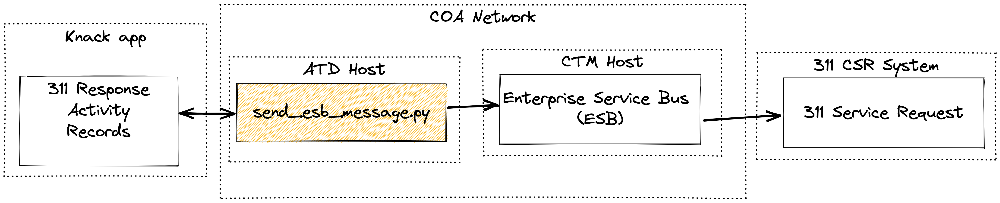

# atd-knack-311

Integration scripts which manage communication between ATD's Knack apps and the City's 311 system.

## Get it running

### Environment

It is possible to run end-to-end tests of all systems involved in the Knack <> 311 integration. The test system credentials are available in our password store and include additional documentation.

The following environment variables are required.

- `KNACK_APP_ID`: the Knack application ID
- `KNACK_API_KEY`: the Knack API key
- `ESB_ENDPOINT`: the URL of the Enterprise Service Bus

### Certificates

A self-signed certificate and key must be present in the project's root directory and saved as `esb.cert` and `esb.pem` respectively.

### Run the script

`send_esb_message.py` 

### Docker

Any push to `main` or `production` will trigger a Github workflow to build and publish a new version of the Docker image to Docker Hub. The image will be tagged with the relevant branch name.
